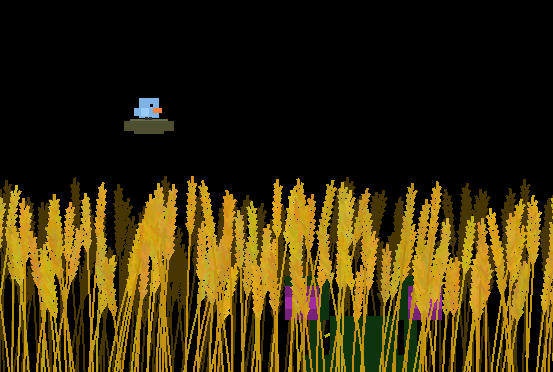

# Ludum Dare 52: Harvest



## Distribution
```
cd game/
zip -r ../love/wheat.love *
```

### Creating windows executable
```
cat ~/Downloads/love-11.4-win64/lovec.exe love/wheat.love > dist64/wheat64.exe
cp ~/Downloads/love-11.4-win64/SDL2.dll ~/Downloads/love-11.4-win64/OpenAL32.dll ~/Downloads/love-11.4-win64/license.txt ~/Downloads/love-11.4-win64/love.dll ~/Downloads/love-11.4-win64/lua51.dll ~/Downloads/love-11.4-win64/mpg123.dll ~/Downloads/love-11.4-win64/msvcp120.dll ~/Downloads/love-11.4-win64/msvcr120.dll dist64/
cd dist64/
zip -r ../wheat64-1.1.0.zip *
```


```
cat ~/Downloads/love-11.4-win32/lovec.exe love/wheat.love > dist32/wheat32.exe
cp ~/Downloads/love-11.4-win32/SDL2.dll ~/Downloads/love-11.4-win32/OpenAL32.dll ~/Downloads/love-11.4-win32/license.txt ~/Downloads/love-11.4-win32/love.dll ~/Downloads/love-11.4-win32/lua51.dll ~/Downloads/love-11.4-win32/mpg123.dll ~/Downloads/love-11.4-win32/msvcp120.dll ~/Downloads/love-11.4-win32/msvcr120.dll dist32/
cd dist32/
zip -r ../wheat32-1.1.0.zip *
```
